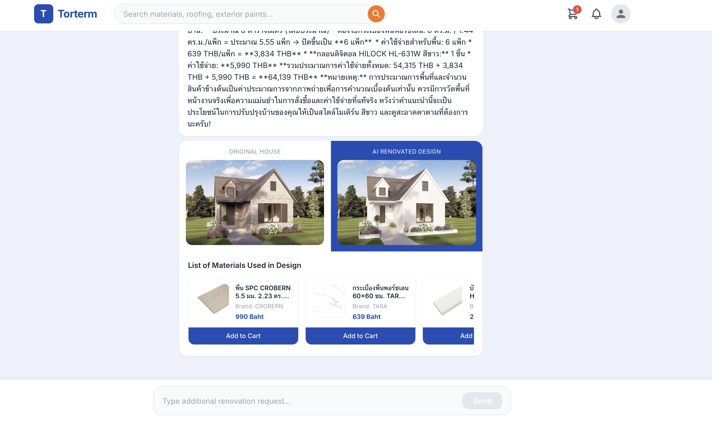

# Torterm — AI Home Renovation Chatbot

Torterm is an AI chatbot for Thai residential exterior renovation. Users upload a house photo, describe what they want, and get:
- AI analysis of which materials go where + cost estimate
- Product recommendations from the Torterm catalog (RAG-powered)
- A renovated version of their actual house photo (requires paid Gemini API key)

**Stack:** Django + ChromaDB + Gemini API (backend) · React + Vite + Tailwind CSS (frontend)

---

## Prerequisites

Make sure you have these installed before starting:

- **Python 3.10+** — `python3 --version`
- **Node.js 18+** — `node --version` (install from [nodejs.org](https://nodejs.org) if missing)
- **A Gemini API key** — get one free at [aistudio.google.com](https://aistudio.google.com/app/apikey)

---

## 1 — Clone the repo

```bash
git clone https://github.com/Skiffet/torterm-chatbot.git
cd torterm-chatbot
```

---

## 2 — Backend setup

### Create and activate a virtual environment

```bash
python3 -m venv .venv
source .venv/bin/activate        # Mac / Linux
# .venv\Scripts\activate         # Windows
```

### Install Python dependencies

```bash
pip install -r requirements.txt
```

### Create the `.env` file

```bash
cp backend/.env.example backend/.env
```

Open `backend/.env` and fill in your Gemini API key:

```
GEMINI_API_KEY=your_gemini_api_key_here
```

> **Note on image generation:** The "AI Renovated Design" panel requires a **paid Gemini API key with credits** (billing enabled at [aistudio.google.com](https://aistudio.google.com)). The free tier has zero quota for image generation models. Everything else — text analysis, product recommendations, and RAG — works on the free key.

### Apply database migrations

```bash
cd backend
python manage.py migrate
```

### Load the product catalog into ChromaDB

This only needs to be done once. It reads the JSON files in `/data` and builds the vector database.

```bash
python ingest_products.py
```

### Start the Django server

```bash
python manage.py runserver
```

Backend runs at `http://localhost:8000`

---

## 3 — Frontend setup

Open a **new terminal tab** (keep the backend running).

```bash
cd frontend
npm install
npm run dev
```

Frontend runs at `http://localhost:5173`

Open that URL in your browser — the chatbot is ready.

---

## 4 — How to use

1. Type a renovation request (e.g. "I want modern white walls with dark wood accents")
2. Optionally attach a house photo using **Upload Photo** or **Take Photo**
3. Hit **Send**
4. The bot responds with:
   - Material recommendations from the catalog
   - Which product goes on which part of the house
   - Cost estimate
   - Before/After image panel (paid API key required for the After image)

---

## Project structure

```
torterm-chatbot/
├── backend/
│   ├── chatbot/          # Django app — views, RAG, prompts
│   ├── torterm_core/     # Django project settings + URLs
│   ├── chroma_db/        # Vector database (auto-generated by ingest_products.py)
│   ├── ingest_products.py
│   └── manage.py
├── frontend/
│   ├── src/
│   │   ├── App.jsx
│   │   └── components/   # ChatInput, ChatMessage, RenovationCard, ProductCard
│   └── vite.config.js    # Proxies /api → localhost:8000
├── data/                 # Scraped product JSON files
├── scraper/              # HomePro scraping scripts
└── requirements.txt
```

---

## Common issues

| Problem | Fix |
|---|---|
| `GEMINI_API_KEY not set` | Check that `backend/.env` exists and has the key |
| `ChromaDB collection not found` | Run `python ingest_products.py` from the backend folder |
| `npm: command not found` | Install Node.js from [nodejs.org](https://nodejs.org) |
| Image renovation shows "unavailable" | Gemini image models require billing — enable it on your API key project |
| CORS error in browser | Make sure Django is running on port 8000 before starting the frontend |


## Example of output

